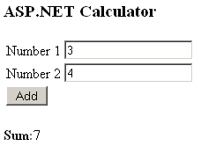

# Running ColdFusion Code in .NET

## Introduction

Converting one development environment to another can be a painstaking process. You've got to take all the code that took months, years to write, test, tweak...etc. and rewrite it in another language. Hopefully after you are done the new code base will pass all of the testcases.

Wouldn't it be handy if your new development environment provided a way so that you could utilize libraries, components written in the old language? This way you can leverage the power of these existing parts while you rewrite other parts of the application. As time goes by and releases are build you can phase out these parts.

Using the old libraries for certain aspects of the application, you can cut down on costs and development time. Management likes to see progress periodically, especially after you've decided to move to a new development environment. And you can gradually ease the transition for the development team as they acquire new skills while still utilizing their existing knowledge.

Let's make a test case, showing you how to ease the transition from ColdFusion to .NET.

## Dynamic Language Runtime (DLR)

The Microsoft .NET Framework 4.0 offers you the new Dynamic Language Runtime (DLR). Think of it as a pluggable back-end for dynamic language compilers. This allows you to reuse libraries / scripts written in dynamic languages such as PHP, Python , Ruby, ColdFusion...etc.

However to use the DLR you need a component that offers support for your dynamic language. For Python there is IronPython, Ruby has IronRuby, PHP has IronPHP...and so on. Unfortunately at the time of writing there is no "Iron" component that offers ColdFusion support for the DLR.

In 2007 a company called New Atlanta spent some time in Microsoft's labs to see if they could build a DLR component for ColdFusion called [IronDragon](http://blog.newatlanta.com/index.cfm?mode=entry&entry=AB37DAFC-8A49-113A-11696DE66062FA8B). Development on this is still ongoing, but it is on the backburner.

## BlueDragon.NET

Despair not. Luckily [New Atlanta](http://www.newatlanta.com/) offers another solution called BlueDragon.NET. Not to be confused with the [XBox 360 game](http://en.wikipedia.org/wiki/Blue_Dragon).

What is BlueDragon.NET? Well basically it's a collection of .NET assemblies for redeploying and integrating ColdFusion (CFML) with any .NET platform. For instance you can run CFML pages without the need for ColdFusion Server, share session, application, local variables...etc. between CFML and ASP.NET pages, call ColdFusion components (CFCs) from .NET, call .NET objects from CFML...and so on.

**Figure 1** - BlueDragon.NET


Let's put these claims to the test. For this article I wrote a very simple ColdFusion component (class in .NET parlance) which represents a calculator and has exactly one method called Add which calculates and returns the sum of two numbers.

Let's pretend that it will take a huge amount of work to rewrite this heavy feature class in C#. I want to protect my ColdFusion investment and reuse the calculator component in .NET. Let's get started...

## ColdFusion Calculator

Before this week I had never programmed in ColdFusion so I had to work my way through some "Hello, World!" tutorials before I got a hang of it. You don't need any ColdFusion knowlegde for this article. However if you're interested I found [Gary R. Gilbert's blog](http://www.garyrgilbert.com/) a handy resource for getting started.

ColdFusion components are usually saved in separate files with the extension CFC. Copy the code shown in Listing 1 and save it to a file called "calculator.cfc".

**Listing 1** - ColdFusion Calculator Component

```xml
<cfcomponent output="no" displayname="calculator">

    <cffunction name="add" access="public" returntype="numeric">
       <cfargument name="number1" required="yes" type="numeric">
       <cfargument name="number2" required="yes" type="numeric">

       <cfset result = 0>
         <!--- Perform the calculation --->
         <cfset result = number1 + number2>
       <cfreturn result>
    </cffunction>

</cfcomponent>
```

The ColdFusion code is pretty readable, if you don't mind the XML-like syntax. Here one component (CfComponent) called "calculator" is declared. This component contains one method, namely "add" which is public and returns a numeric type. The function declares two numeric parameters (number1 & number2), calculates the sum of these and returns the result.

## Adobe ColdFusion Server

You don't need to install the ColdFusion Server if you are not going to write ColdFusion code yourself. However if you would like to experiment with it you can download it here:

[Adobe ColdFusion Server 8](http://www.adobe.com/products/coldfusion/coldfusion8/)

When you run the install wizard make sure to check the "Server Configuration" option and configure ColdFusion for all of your IIS websites. Afterwards just setup a new virtual directory under the default website and you can place your ColdFusion pages (\*.cfm) and components (\*.cfc) in here.

[More information about setting up a ColdFusion development environment can be found on Adobe's site](http://www.adobe.com/devnet/dreamweaver/articles/setup_coldfusion_02.html).

If you want to test drive the calculator component in its native environment then you can use the following code for your ColdFusion page. Just save the code shown in Listing 2 in a new file called index.cfm and save it in the same virtual directory that contains the calculator component.

**Listing 2** - ColdFusion Calculator Form

```html
<html>
<head><title>ColdFusion Calculator</title></head>
<body>
    <h3>ColdFusion Calculator</h3>
    <form name="myform" method="post">
        <table>
            <tr><td>Number 1</td><td><input type="text" name="number1" /></td></tr>
            <tr><td>Number 2</td><td><input type="text" name="number2" /></td></tr>
            <tr><td><input type="submit" name="add" value="Add" /></td></tr>
        </table>
    </form>
    <cfif isdefined("form.add")>
        <cfif IsNumeric(form.number1) and IsNumeric(form.number2)>
            <cfobject name="calculatorInstance" component="calculator">
            <cfset result = calculatorInstance.add(#form.number1#, #form.number2#) />
            <p><strong>Sum</strong>: <cfoutput>#result#</cfoutput></p>
      <cfelse>
          <p><strong>Please enter two valid integer values!</strong></p>
        </cfif>
    </cfif>
</body>
</html>
```

When you request this file in a browser, you'll be presented with a simple form. Just enter two numbers and click the Add button.

**Figure 2** - ColdFusion Calculator In Action!


## BlueDragon for the Microsoft .NET Framework

Before you can leverage the ColdFusion calculator component using C# you need to install [BlueDragon for the Microsoft.NET Framework](http://www.newatlanta.com/c/products/bluedragon/download/home). At the time of writing the latest version is [BlueDragon 7.1](http://www.newatlanta.com/products/bluedragon/self_help/docs/7_1/BlueDragon_71_Whats_New.pdf). The download is about 40.4 Megabytes. The trial is valid for 30 days without any annoying nag screens, but you are restricted to your local IP.

During the installation process you can choose to configure BlueDragon for:

- All Web Sites
- Selected Web Site(s)
- Manual Configuration
- Single Virtual Directory

This allows the Microsoft IIS web server and the .NET framework to process the ColdFusion files (\*.cfm, \*.cfc...etc.).

Choose the first option ("All Web Sites"). This will cause the BlueDragon .NET assemblies to be registered in the Global Assembly Cache (GAC). We are particularly interested in the following assemblies:

- BlueDragon.dll
- BlueDragon.Controls.dll
- BlueDragon.Utils.dll

Just because these files are registered in the GAC, does not mean that you can select them when you open the Add Reference dialog in Visual Studio. You need to add an entry for each assembly to the Windows Registry to enable this.

Open a new command prompt and enter the following command:

```sh
"dir c:\\windows\\assembly\\gac_msil | more"
```

You then get a list of various assemblies. The BlueDragon assemblies should be displayed somewhere at the top.

**Figure 3** - BlueDragon.NET assemblies


To display an assembly in the Add Reference dialog box, you need to add a registry key, such as the following, which points to the location of the assembly:

\[HKEY_CURRENT_USER\\SOFTWARE\\Microsoft\\.NETFramework\\AssemblyFolders\\BlueDragon\]@= "C:\\\\BlueDragon"

where BlueDragon is the name of the folder in which the assemblies resides.

**Remark**: You can create the this registry entry under the HKEY_LOCAL\_ MACHINE hive. This will change the setting for all of the users on the system. If you create this registry entry under HKEY_CURRENT_USER, this entry will affect the setting for only the current user. Restart Visual Studio .NET after you have added the key!

Now go ahead and do this for each of the three BlueDragon.NET assemblies.

**Figure 4** - Windows Registry


After you've restarted Visual Studio they will be displayed in the Add Reference dialog.

**Figure 5** - Add Reference


## ASP.NET Calculator

Start Visual Studio and create a new blank solution called BlueDragon. Add a new Code Library project to it and call it ColdFusion.Logic. Add references to all three of the BlueDragon .NET assemblies (BlueDragon.dll, BlueDragon.Controls.dll & BlueDragon.Utils.dll).

Within this code library create a new folder named ColdFusion and add the calculator.cfc component to this folder. Set its build action to Content.

Now you need to create a wrapper for the ColdFusion calculator component. Add a new class called Calculator and add the code shown in Listing 3 to it.

**Listing 3** - Calculator Class

```csharp
public class Calculator
{
    private readonly CfComponent _coldFusionComponent =
        new CfComponent("/bin/ColdFusion/calculator");

    public int Add(int number1, int number2)
    {
        object cfResult =
            this._coldFusionComponent.Invoke("add",
            new[] { number1.ToString(), number2.ToString() });
        return Int32.Parse(  cfResult.ToString() );
    }
}
```

The CfComponent type provided by BlueDragon.NET allows you to load a ColdFusion component and invoke its methods. Here the calculator.cfc component is loaded and the Add(...) method forwards the computation to the ColdFusion component. After the sum has been calculated, the result is returned. (The location of the calculator.cfc component is hardcoded for this example. Feel free to improve this.)

**Remark**: Prior to BlueDragon 7.1 it was not possible to create an instance of the CfComponent type yourself as it had no public constructors.

## Global.asax

All the plumbing has been done. It would be nice to see the ColdFusion code be executed from within a .NET application. Add a new web site to the solution using the Web Application project template and give it the original name, "WebApplication". Add a reference to the ColdFusion.Logic project and the BlueDragon.dll assembly.

**Figure 6** - The Solution


I deleted the automatically generated Default.aspx, then added a new page (Index.aspx) and recreated the simple calculator form (see Figure 2) in ASP.NET.

**Figure 7** - ASP.NET Calculator



Just download the source code for this article to see how the form was built. If you click on the Add button a new instance of the Calculator type will be created and the sum of the two numbers will be calculated by the ColdFusion component.

If you run the web application now you'll receive an exception as soon as you click the Add button. In order to execute ColdFusion code you need to load BlueDragon so it can plugin to the ASP.NET Request pipeline. Add a global.asax file to the project and replace it's markup code with the following line:

**Listing 4** - Global.asax Markup Code

```xml
<%@ Application Codebehind="Global.asax.cs" Inherits="NewAtlanta.BlueDragon.Global" Language="C#" %>
```

Now open up the global.asax code-behind file and replace its code by this:

**Listing 5** - Global.asax Code-behind

```csharp
public class Global : NewAtlanta.BlueDragon.Global
{
    protected void Application_Start(object sender, EventArgs e)
    {
        // Initialize BlueDragon.NET
        base.Application_Start();
        //...
    }

    protected void Session_End(object sender, EventArgs e)
    {
        base.Session_End();
        //...
    }

    protected void Application_End(object sender, EventArgs e)
    {
        // Shutdown BlueDragon.NET
        base.Application_End();
        //...
    }
}
```

This will make sure that the BlueDragon runtime is loaded and that all ColdFusion requests will succeed. BlueDragon.NET is implemented as a couple of HTTP Handlers. If you configured BlueDragon.NET for all of your web sites during the installation process then these handlers can be found in the machine wide Web.config file. If not, then you need to add them to the configuration file (Web.config) of your project.

**Listing 6** - BlueDragon Http Handlers

```xml
add verb="*" path="*.cfchart" type="..." validate="false" />
<add verb="*" path="*.cfc" type="..." validate="false" />
<add verb="*" path="*.cfml" type="..." validate="false" />
<add verb="*" path="*.cfm" type="..." validate="false" />
```

**Remark**: Checkout the machine wide Web.config file or the source code of this article for the full code required to register the BlueDragon.NET Http Handlers. I've shortened the code here for readability purposes.

If you start the web application now, everything will run fine. Enter two numbers, click Add and ColdFusion will calculate and return the sum. How cool is that! If you want to test that the code of the ColdFusion component is really executed, just change it. For instance always add 100 to the calculated sum. You don't need to recompile your .NET application. The next time you click the Add button the new ColdFusion code will be executed.

## Summary

You have to perform quite some work to be able to execute ColdFusion code from within a .NET application. However, once you've setup BlueDragon.NET, executing ColdFusion code is quite easy thanks to the power of the CfComponent type.

This article showed you how you can reuse a component (\*.cfc) written in ColdFusion, but there's nothing that stops you from including entire ColdFusion pages (\*.cfm) inside of your ASP.NET application.
